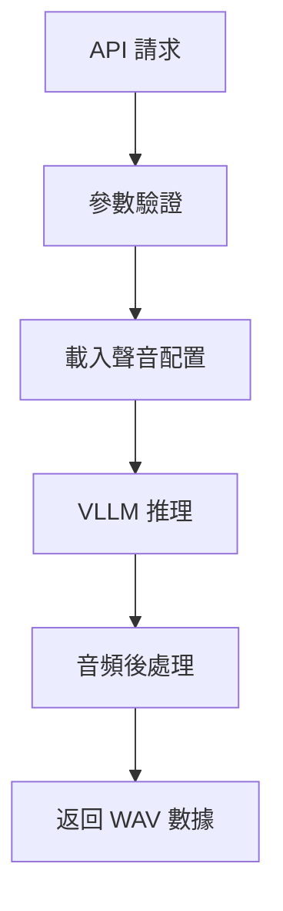

# IndexTTS Service - 語音克隆服務

> 基於 VLLM 的高性能 IndexTTS 語音克隆服務，支援自定義聲音和實時語音合成

## 🎯 服務概述

IndexTTS Service 是一個專業的語音克隆服務，基於 IndexTTS 模型和 VLLM 推理引擎，提供高品質的語音合成和語音克隆功能。

### ✨ 主要特色

- 🔬 **語音克隆技術** - 基於參考音頻自動克隆聲音特徵
- ⚡ **VLLM 加速推理** - 高性能推理引擎，提升生成速度
- 🎵 **多聲音支援** - 支援多個預設聲音和自定義聲音
- 🔧 **健康檢查** - 完整的服務健康監控
- 🐳 **Docker 容器化** - 完整的容器化部署方案
- 📊 **RESTful API** - 標準化的 API 接口
- 🎯 **自動模型管理** - 自動下載和轉換模型格式

## 🚀 快速開始

### 環境需求

- Docker 和 Docker Compose
- 至少 8GB 可用記憶體
- NVIDIA GPU（推薦，用於加速推理）
- 至少 10GB 可用磁碟空間

### 🐳 Docker 部署

#### 1. 使用 Docker Compose（推薦）

```bash
# 在 ai-virtual-human 根目錄下
docker-compose up indextts-service -d
```

#### 2. 獨立 Docker 部署

```bash
# 進入 indextts-service 目錄
cd indextts-service

# 構建映像
docker build -t indextts-service .

# 運行容器
docker run -d \
  --name indextts-service \
  -p 8001:8001 \
  -v $(pwd)/checkpoints:/app/checkpoints \
  -v $(pwd)/assets:/app/assets \
  indextts-service
```

### 📋 環境變數配置

```bash
# 基本配置
INDEXTTS_PORT=8001                    # 服務端口
INDEXTTS_MODEL_DIR=./checkpoints      # 模型存放目錄
INDEXTTS_CONFIG_DIR=/app/config       # 配置文件目錄

# 模型配置
INDEXTTS_MODEL_NAME=IndexTeam/IndexTTS-1.5  # 模型名稱
USE_MODELSCOPE=1                      # 使用 ModelScope 下載模型

# 推理配置
GPU_MEMORY_UTILIZATION=0.8            # GPU 記憶體使用率
VLLM_USE_V1=0                        # VLLM 版本設置
```

## 🎵 聲音配置

### 聲音配置文件

聲音配置存放在 `assets/voices.json` 文件中。首次部署時，請複製範例文件：

```bash
# 複製範例配置文件
cp assets/voices.sample.json assets/voices.json

# 編輯配置文件
nano assets/voices.json
```

**配置文件格式**：

```json
{
  "voices": [
    {
      "id": "Hayley",
      "name": "Hayley 開心活潑",
      "character": "hayley",
      "audio_paths": ["/app/assets/voices/hayley/Hayley開心說開場白.mp3"],
      "description": "Hayley 開心活潑的聲音",
      "seed": 2
    },
    {
      "id": "anchorman1",
      "name": "主播男聲",
      "character": "anchorman",
      "audio_paths": ["/app/assets/voices/anchorman/anchorman1_4_1070748_1426635.wav"],
      "description": "專業主播男聲",
      "seed": 8
    },
    {
      "id": "Cindy",
      "name": "Cindy",
      "character": "cindy",
      "audio_paths": ["/app/assets/voices/cindy/Cindy_8_1361920_1537600.wav"],
      "description": "Cindy 的聲音",
      "seed": 5
    }
  ]
}
```

### 添加自定義聲音

1. **準備參考音頻**：
   ```bash
   # 音頻要求
   - 格式：WAV, MP3
   - 採樣率：16kHz 或 22.05kHz
   - 長度：5-30 秒
   - 品質：清晰、無背景噪音
   ```

2. **放置音頻文件**：
   ```bash
   # 創建聲音目錄
   mkdir -p assets/voices/my_voice
   
   # 複製音頻文件
   cp my_reference.wav assets/voices/my_voice/
   ```

3. **更新配置文件**：
   ```json
   {
     "id": "my_voice",
     "name": "我的自定義聲音",
     "character": "custom",
     "audio_paths": ["/app/assets/voices/my_voice/my_reference.wav"],
     "description": "基於我的聲音克隆",
     "seed": 10
   }
   ```

## 🔧 API 接口

### 健康檢查

```bash
GET /health
```

**回應範例**：
```json
{
  "status": "healthy",
  "message": "Service is running",
  "timestamp": 1758176899.9160903
}
```

### 語音合成

```bash
POST /tts_url
Content-Type: application/json
```

**請求參數**：
```json
{
  "text": "你好，這是測試文本",
  "audio_paths": ["/app/assets/voices/hayley/Hayley開心說開場白.mp3"],
  "seed": 2
}
```

**回應**：
- 成功：返回 WAV 音頻數據（16kHz）
- 失敗：返回錯誤訊息

### 使用範例

```bash
# 健康檢查
curl http://localhost:8001/health

# 語音合成
curl -X POST "http://localhost:8001/tts_url" \
  -H "Content-Type: application/json" \
  -d '{
    "text": "你好，歡迎使用 IndexTTS 語音克隆服務",
    "audio_paths": ["/app/assets/voices/hayley/Hayley開心說開場白.mp3"],
    "seed": 2
  }' \
  --output generated_audio.wav
```

## 🏗️ 技術架構

### 核心組件

1. **IndexTTS 模型**：
   - 基於 Transformer 的語音合成模型
   - 支援零樣本語音克隆
   - 高品質音頻生成

2. **VLLM 推理引擎**：
   - 高性能推理加速
   - GPU 記憶體優化
   - 批次處理支援

3. **API 服務層**：
   - FastAPI 框架
   - RESTful API 設計
   - 異步處理支援

### 服務流程



## 📊 性能優化

### GPU 記憶體優化

```bash
# 調整 GPU 記憶體使用率
export GPU_MEMORY_UTILIZATION=0.8  # 使用 80% GPU 記憶體
```

### 模型快取

```bash
# 模型會自動快取到 checkpoints 目錄
ls -la checkpoints/
# 預期看到：
# - IndexTeam--IndexTTS-1.5/
# - 其他模型文件
```

### 批次處理

服務支援批次處理多個請求，提升吞吐量：

```python
# 批次請求範例（Python）
import requests
import asyncio

async def batch_tts(texts, audio_paths, seed=2):
    tasks = []
    for text in texts:
        task = requests.post(
            "http://localhost:8001/tts_url",
            json={
                "text": text,
                "audio_paths": audio_paths,
                "seed": seed
            }
        )
        tasks.append(task)
    return await asyncio.gather(*tasks)
```

## 🛠️ 故障排除

### 常見問題

#### Q: 服務啟動失敗？

**檢查日誌**：
```bash
docker-compose logs indextts-service
```

**常見原因**：
1. GPU 記憶體不足
2. 模型下載失敗
3. 端口衝突

#### Q: 模型下載緩慢？

**解決方案**：
```bash
# 使用 ModelScope 鏡像（中國用戶）
export USE_MODELSCOPE=1

# 或手動下載模型
git clone https://huggingface.co/IndexTeam/IndexTTS-1.5 checkpoints/IndexTeam--IndexTTS-1.5
```

#### Q: 語音生成品質差？

**優化建議**：
1. 使用高品質參考音頻
2. 調整 seed 參數
3. 確保參考音頻長度適中（5-30秒）

#### Q: API 請求超時？

**調整超時設置**：
```bash
# 在客戶端增加超時時間
curl -X POST "http://localhost:8001/tts_url" \
  --max-time 180 \  # 3分鐘超時
  -H "Content-Type: application/json" \
  -d '{"text": "長文本...", "audio_paths": [...], "seed": 2}'
```

### 日誌分析

**重要日誌位置**：
```bash
# 容器日誌
docker-compose logs indextts-service

# 服務日誌
ls -la logs/
# - entrypoint_*.log  # 啟動日誌
# - api_server.log    # API 服務日誌
```

**日誌級別**：
- `INFO`: 正常運行訊息
- `WARNING`: 警告訊息
- `ERROR`: 錯誤訊息

## 🔒 安全考量

### 生產環境建議

1. **API 限流**：
   ```python
   # 建議添加請求限制
   from slowapi import Limiter
   
   limiter = Limiter(key_func=get_remote_address)
   app.state.limiter = limiter
   ```

2. **輸入驗證**：
   ```python
   # 文本長度限制
   MAX_TEXT_LENGTH = 1000
   
   # 音頻路徑驗證
   ALLOWED_AUDIO_PATHS = ["/app/assets/voices/"]
   ```

3. **資源監控**：
   ```bash
   # 監控 GPU 使用率
   nvidia-smi
   
   # 監控記憶體使用
   docker stats indextts-service
   ```

## 📈 監控和維護

### 健康檢查

```bash
# 自動健康檢查腳本
#!/bin/bash
while true; do
  if curl -f http://localhost:8001/health > /dev/null 2>&1; then
    echo "$(date): Service is healthy"
  else
    echo "$(date): Service is unhealthy"
    # 可以添加重啟邏輯
  fi
  sleep 60
done
```

### 性能監控

```bash
# 檢查服務性能
curl -w "@curl-format.txt" -o /dev/null -s "http://localhost:8001/health"

# curl-format.txt 內容：
#     time_namelookup:  %{time_namelookup}\n
#        time_connect:  %{time_connect}\n
#     time_appconnect:  %{time_appconnect}\n
#    time_pretransfer:  %{time_pretransfer}\n
#       time_redirect:  %{time_redirect}\n
#  time_starttransfer:  %{time_starttransfer}\n
#                     ----------\n
#          time_total:  %{time_total}\n
```

## 🔄 更新和維護

### 模型更新

```bash
# 更新到新版本模型
docker-compose down indextts-service
rm -rf checkpoints/IndexTeam--IndexTTS-1.5
docker-compose up indextts-service --build
```

### 配置更新

```bash
# 更新聲音配置後重啟服務
docker-compose restart indextts-service
```

### 備份重要數據

```bash
# 備份聲音配置和音頻文件
tar -czf indextts-backup-$(date +%Y%m%d).tar.gz \
  assets/voices.json \
  assets/voices/ \
  checkpoints/
```

## 🙏 致謝

特別感謝以下項目：

- **[IndexTTS](https://github.com/index-tts/index-tts)**: 語音克隆核心技術
- **[VLLM](https://github.com/vllm-project/vllm)**: 高性能推理引擎
- **[FastAPI](https://fastapi.tiangolo.com/)**: 現代 Web 框架
- **[ModelScope](https://modelscope.cn/)**: 模型託管平台

---

**© 2025 Create Intelligens Inc. | IndexTTS Service**

> 🔬 專業的語音克隆技術，為您的應用提供個性化語音體驗
